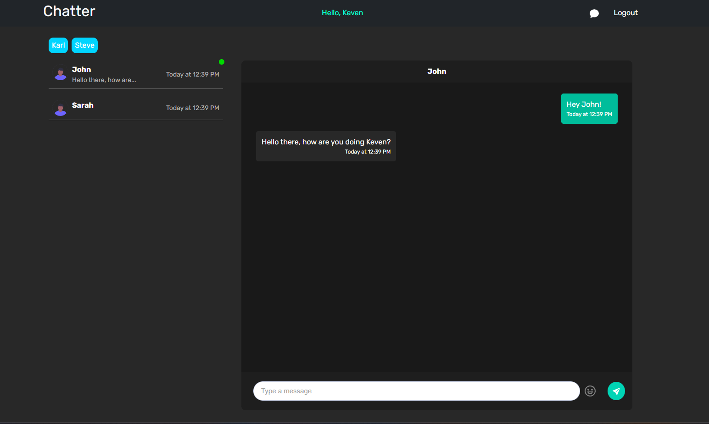
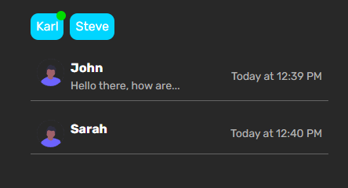
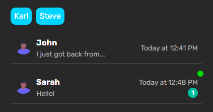
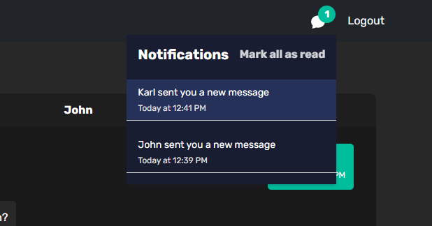

# Chatter
Project creating a basic chatting app using react and socket.io

Features:
    
    - Real-time chat messaging through Socket.io
    - Real-time Notifications
    - Live updating Online status for other users
    - Time Stamps for each message and latest message displayed
//

    This is the full site after logging in and starting a conversation:

    Online status of users + latest message preview

    Notifications displayed beside user 

    Notification tray with shorcuts to conversations + ability to Mark all as read

